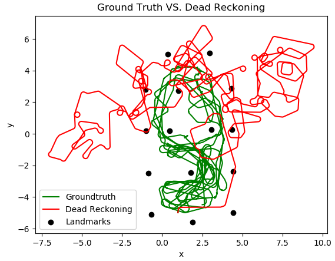

# Machine Learning & Artificial Intelligence, ME 469
## Homework 0, Part A
### Maurice Rahme
### Student ID: 3219435

### Assigned Filter: Particle Filter
### Assigned Data Set: ds0

****
## Dependencies
The code for this submission is written in Python 2.7 using PEP8 Styling. 
The libraries used for this code are:
* ``` Numpy ```
* ``` Matplotlib ```
* ``` Pandas ``` (mentioned in my email)

**PLEASE MAKE SURE TO RUN THE FILE IN THE ```hw_0``` DIRECTORY ON YOUR TERMINAL**
****
## Coded Exercises
When you run ``` ./run.py ``` (after writing the command: ``` chmod +x run.py ```), you will be prompted to select an exercise: 2, 3, or 6. The numbering corresponds to the labeling in the homework description. You can also run the executable using ``` run run.py ```.
### Exercise 2:

#### Operation:
Funtion ```a2()```
After selecting your response for whether or not to include noise in the model, the ``` Robot ``` Class, which stores the ``` position ``` vector attribute of the robot, performs its ``` move ``` method iteratively for each command as given in the assignment by applying the motion model.

The plot is animated to show the subtle change in behaviour in case noise is implemented; you will notice that the noise-inclusive plot may change directions thanks to the added noise on $$\theta$$. The starting point is indicated by a black dot, the intermediate point by black diamonds, and the end point by a purple dot. 


### Exercise 3:
#### Operation:
Function ```a3()```
Upon selecting this exercise, you will also be asked whether or not noise should be added to the model. Subsequently, you will be asked whether to plot the full Dead Reckoning versus Ground Truth paths, or just the first 2000 iterations of the plot, where I have identified the start of the major divergence between the two. This functionality is achieved using list comprehension, by storing the first 2000 elements of the lists for the complete paths and plotting them if requested. 

The ``` Robot ``` Class is reused in this exercise, however, the ```controls``` list is fed data from the ```ds0_Odometry.dat``` file, which is read using ```Pandas``` and stored as a list of 64-bit floats using the function ```read_dat()``` which takes for arguments the index at which to start storing useful data (since the .dat file begins with headers), the file path, and the name of the columns. The ```read_dat()``` function is called in ```main()``` to read all the relevant data for this submission, including ```ds0_Groundtruth.dat```, and ```ds0_Landmark_Groundtruth.dat```. The former of these is used to be plotted alongside the dead reckoning data. 

In the resultant plot, the starting point for both the Dead Reckoning and Ground Truth states is shown as a yellow dot. The Dead Reckoning path is plotted in black, and the Ground Truth path in green. Both paths end with a purple marker in their 2000-iteration and full path plots. 




### Exercise 6: 
#### Operation:
Function ```a6()```
The ```Robot``` Class has an additional method, ```measure_a6()```, which computes the inverse model with (optional) measurement noise characterised by the standard deviations in $$x$$ and $$y$$ provided for landmarks 6, 13, and 17, followed by the forward model to quantify the error due to noise. For the error output, the resultant absolute cartesian landmark location is compared to the Ground Truth data. If the noise option is not selected, the executable will output ```0``` in some cases, but may also output a number with a factor of ```E-16``` due to the rounding associated with the ```Numpy``` trigonometric operations in the forward and reverse models. This function also outputs the range and bearing of each measurement, as requested.

The pose data used here as well as the chosen landmarks are provided in the homework assignment. 


### Exercise 7:
#### Operation 
Running this exercise, you have the option to plot the Particle Filter either with the commands from exercise 2, or the odometry data from exercise 6. The detailed operation of this section of code can be viewed in the report. The two functions used here are ```pf2()``` and ```pf()``` for the exercise 2 and odometry implementations (respectively) of the particle filter.

PF with exercise 2:


PF with Odometry Data:


PF limited Odometry Plot:


PF with no measurement Plot:


