# Machine Learning & Artificial Intelligence, ME 469
## Homework 1, Part A
### Maurice Rahme
### Student ID: 3219435

### A* Search Implementation, Naive and Online
### Assigned Data Set: ds1

****
## Dependencies
The code for this submission is written in Python 2.7 using PEP8 Styling. 
The libraries used for this code are:
* ```Numpy ```
* ```Matplotlib ```
* ```Pandas ```
* ```heapq``` for optimisation

**PLEASE MAKE SURE TO RUN THE FILE IN THE ```hw_1``` DIRECTORY ON YOUR TERMINAL**
****
## Coded Exercises
When you run ``` ./run.py ``` (after writing the command: ``` chmod +x run.py ```), you will be prompted to select an exercise: ```3```, ```5```, or ```7```. The numbering corresponds to the labeling in the homework description. You can also run the executable using ``` run run.py ```.

### Exercise 3:
#### Operation:
Enter ```3``` at the command prompt to plot for this exercise.

The Naive A* search is implemented here with a 1x1 grid. The path displayed here is often more optimal than that of the online search, as it (less realistically) allows the robot to back up and pick a better path if one is found. Plots can be printed for Start and Goal sets ```A```, ```B``` and ```C``` by inputting these values (upper or lower case) at the command prompt. Open and Closed list nodes are plotted to provide a visual of required computational power for each search. 

A Plot:


B Plot:


C Plot:


### Exercise 5:
#### Operation:
Enter ```5``` at the command prompt to plot for this exercise.

The Online A* search is implemented here with a 1x1 grid. The path displayed here is less optimal than that of the naive search, the realistic implementation prevents the robot from back-tracking by only adding the lowest-cost neighbour to the open list at each iteration. Plots can be printed for Start and Goal sets ```A```, ```B``` and ```C``` by inputting these values (upper or lower case) at the command prompt. Open and Closed list nodes are not plotted here as they simply consist of the followed path. 

A Plot:


B Plot:


C Plot:


### Exercise 7: 
#### Operation:
Enter ```7``` at the command prompt to plot for this exercise.

The Online A* search is implemented here with a 0.1x0.1 grid and obstacles inflated by .3m in each direction. The path displayed here is less optimal than that of the naive search, the realistic implementation prevents the robot from back-tracking by only adding the lowest-cost neighbour to the open list at each iteration. Plots can be printed for Start and Goal sets ```A```, ```B``` and ```C``` by inputting these values (upper or lower case) at the command prompt.

The same environment is navigated using the Naive A* for comparison purposes. At the command prompt, enter ```ONLINE``` or ```NAIVE``` (upper or lower case) to plot accordingly. As before, only the naive algorithm plots the expanded nodes.  

A Plot:

Online:

Naive:


B Plot:

Online:

Naive:


C Plot:

Online:

Naive:


Note that in these screenshots, the path sometimes appear to intersect with an obstacle. If you zoom in after running the code, you will see that this is not actually the case. 

### Exercise 9: 
#### Operation:
Enter ```9``` at the command prompt to plot for this exercise.

Here, the robot follows the paths generated by the online A* using a Proportional Controller. The green arrows show the heading at every 10th time step.

A Plot:

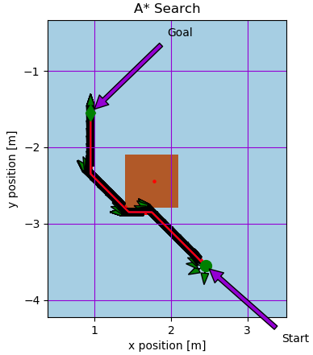

B Plot:

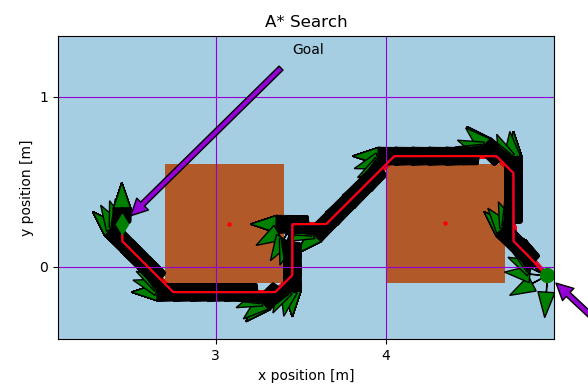

C Plot:

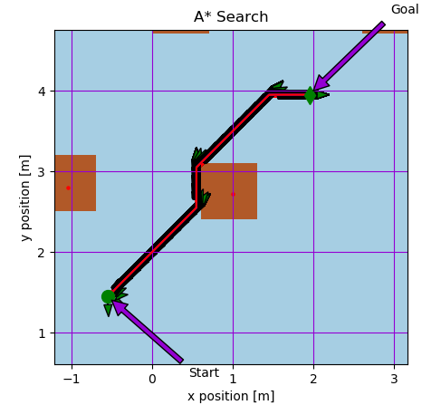

Note that in these screenshots, the path sometimes appear to intersect with an obstacle. If you zoom in after running the code, you will see that this is not actually the case. 

### Exercise 10: 
#### Operation:
Enter ```10``` at the command prompt to plot for this exercise.

Here, the robot moves and plans path simultaneously.

A Plot:

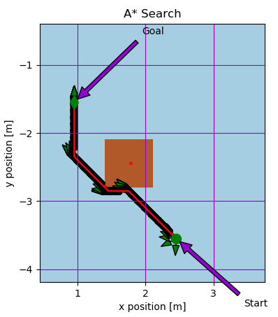

B Plot:

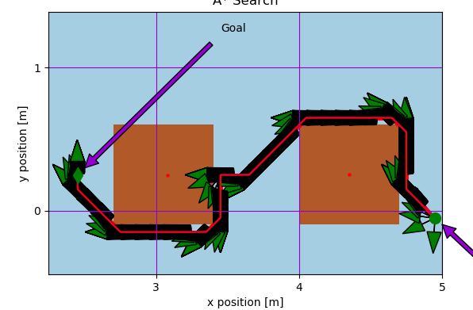

C Plot:

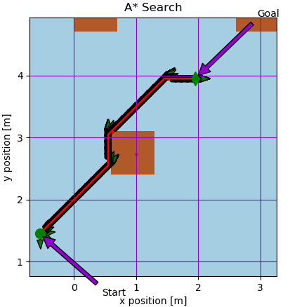

Note that in these screenshots, the path sometimes appear to intersect with an obstacle. If you zoom in after running the code, you will see that this is not actually the case.

Thanks to the P controller, the re-plan case was never instantiated since the robot always landed in the correct cell. By uncommenting lines 1014 and 1015 in run.py, you can perturb the 15th iteration of the B plot to see an example of a replan case.

Replan:

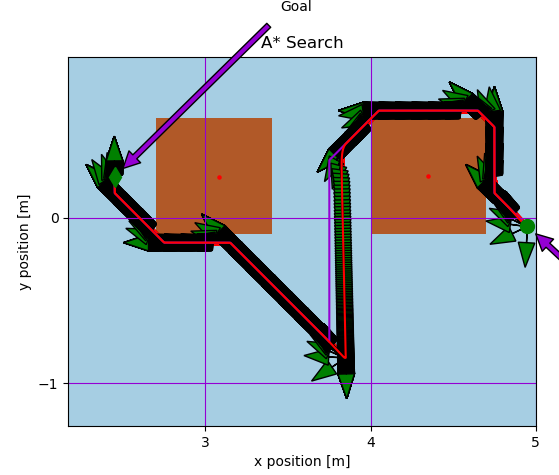

Zoomed Plot:

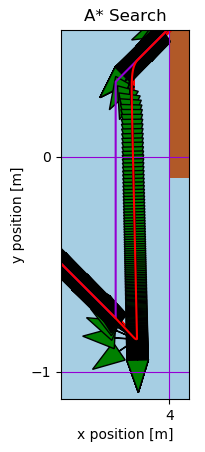

### Exercise 11: 
#### Operation:
Enter ```11``` at the command prompt to plot for this exercise.

Here, the robot moves and plans simultaneously for the start and goal coordinates of Exercise 3 using a Fine and Coarse Grid. 

A Plot:

Fine:

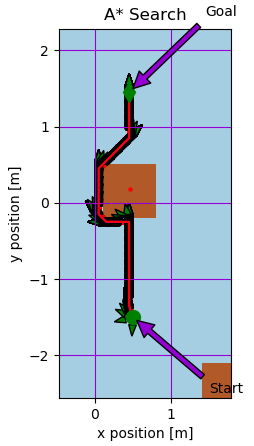

Coarse:

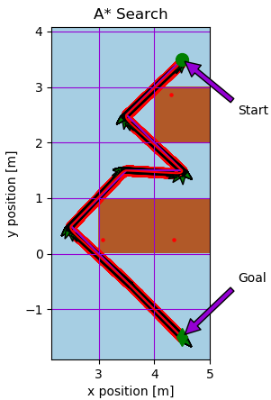

B Plot:

Fine:

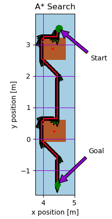

Coarse:


C Plot:

Fine:

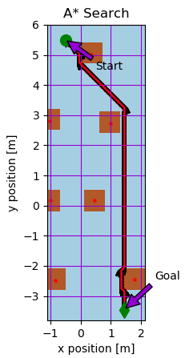

Coarse:


### Better Plots:
As mentioned in the report, the exercise requires a g(n) = 1 for traversing between adjacent nodes, whether the path is diagonal or straight. This limits the h(n) choice to the Octile distance function. Conversely, if g(n) = sqrt(2) is used for diagonal neighbour nodes, the Chebyshev h(n) can be used, which produces the following (shorter, and containing fewer turns) plots:

3A Plot:

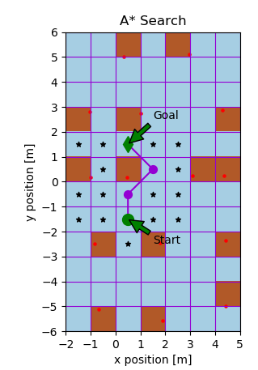

3B Plot:

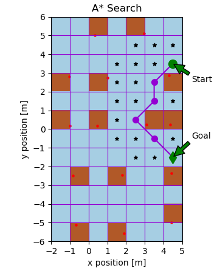

3C Plot:

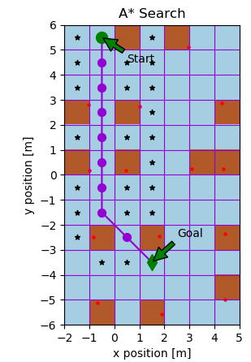

5A Plot:

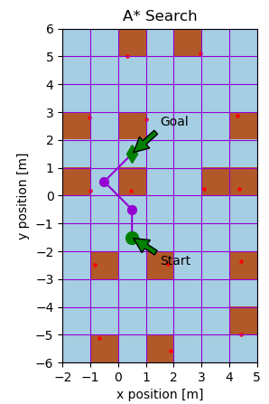

5B Plot:


5C Plot:


7A Online Plot:

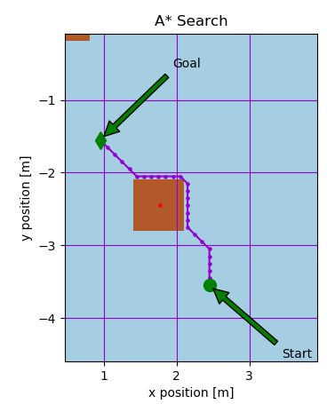

7B Online Plot:

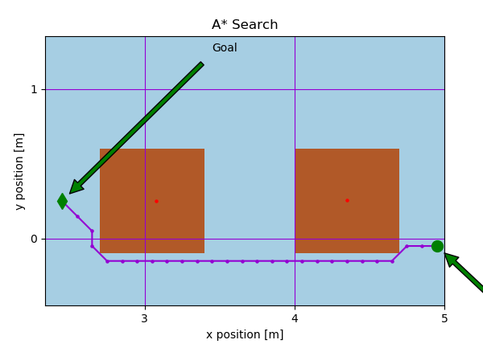

7C Online Plot:

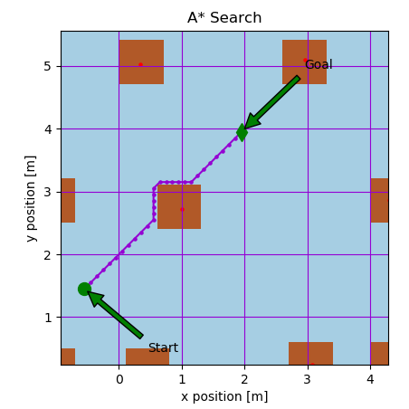

9A Plot:

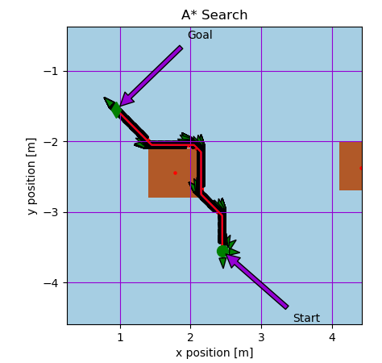

9B Plot:

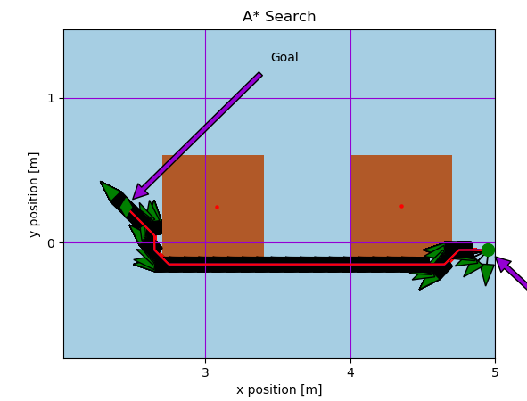

9C Plot:

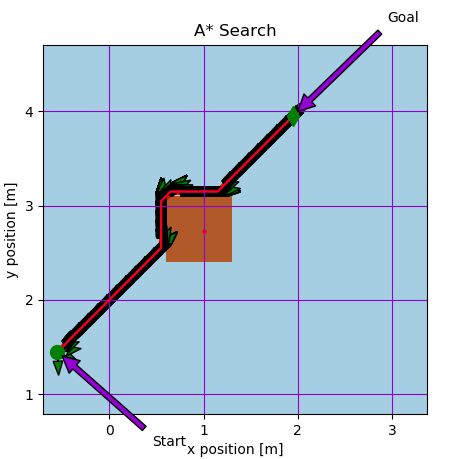

10A Plot:

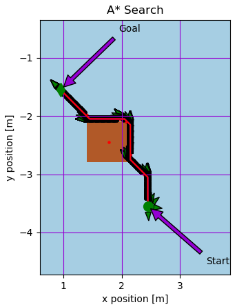

10B Plot:

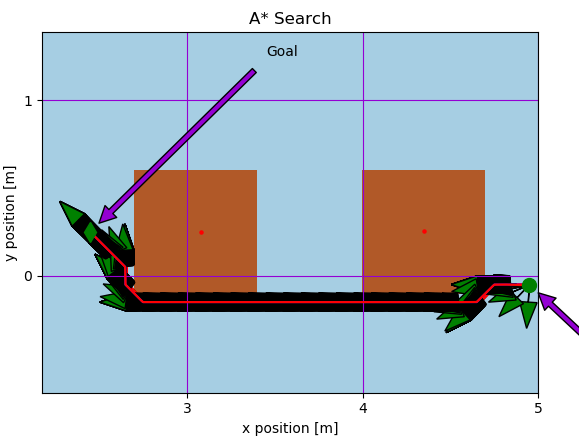

10C Plot:

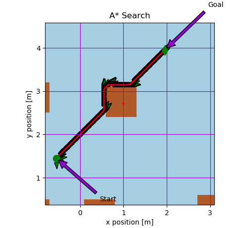

11A Plot:

Fine:

[plot1](media/Optimal/11A_Fine.png)

Coarse:

[plot](media/Optimal/11A_Coarse.png)

11B Plot:

Fine:

[plot2](media/Optimal/11B_Fine.png)

Coarse:

[plot3](media/Optimal/11_B_Coarse.png)

11C Plot:

Fine:

[plot4](media/Optimal/11C_Fine.png)

Coarse:

[plot5](media/Optimal/11_C_Coarse.png)

As can be seen by these plots, the path traced by the online A* search using g(n) = sqrt(2) and the Chebyshev distance more closely matches the offline (naive) version than the paths produced in the official report.